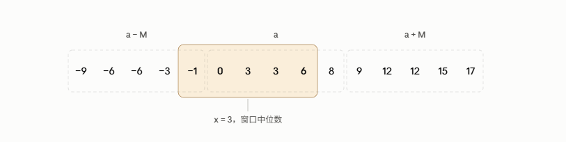

# Farmer John's Favourite Operation题解

## Ref
原题：https://usaco.org/index.php?page=viewproblem2&cpid=1471
社区题解：https://usaco.guide/problems/usaco-1471-farmer-johns-favorite-operation/solution

## 前置知识补充
先抛开题目本身不谈，我觉得很有必要推导一些必要的前置知识。由于该题被划分为前缀和类型，我姑且默认你只懂前缀和。
1. 取数列`|a^i - x|`的最小和问题
给定一串数列a^n，让你找一个数x，每项与x取绝对值后累加，要求让这个累加的值最小。这里x的答案是原数列排序后的中位数，直觉上很好理解，想象如果x“偏左”，那么只要它往右一些，左边部分与之相减的绝对值会更小，右边部分与之相减的绝对值也会更小，直到他到中位数。
2. 同余和取模
`a-b能被M整除`这个命题可以用数学形式写作`a=b(mod M)`，读作a与b同余M，另可以读作a除以M余数为b，因此b在这个情景下可以称为“余数”。
另可以写作`a = b + kM`，观察到这个形式可以把“a的可能取值”展开为一个等差数列：
```cpp
a = {..., b - 2M, b - M, b, b + M，b + 2M, ...}
```
假设除数M是9，余数是3，那么a的可能取值就为
```cpp
a = {..., -15, -6, 3, 12, 21, 30, ...}
```
因此，如果给定除数M与余数b，那么选择a的本质是从这个等差数列中挑选一个元素。
3. 下标的环链转换
在环上截取一个片段时，如果这个片段本身就经过头尾，那么直接处理它的索引会很麻烦，一般会选择把环“拉”成链。想象一个环：
```cpp
0, 1, 2, 3, 4, 5
```
现在在这上面截取`5，0，1`这个片段
```cpp
5, 0, 1
```
构建所需的链，想象拆成`5`和`0，1`再分别补全循环
```cpp
0, 1, 2, 3, 4, 5, 0, 1, 2, 3, 4, 5
```
可以简单观察到这个链的长度是2n，其实只是把环铺平后，在后面再接个一遍
4. 模数的环链转换
取模比较特殊，上述例子中，a的取值可以有3，12，21，...，所以每往后绕一圈都会加一个M，每往前绕一圈都会减一个M，因此对于模运算，构建链时需要往前接一个再往后接一个，
假设a是把环铺平形成的链，那么我们需要构建的是链就是：
```
b = {a - M, a, a + M}
```
长度为3n

## 题目讲解
题目给定一个数组a，对于任意数x，要求“变换”数组a，使得a中每个元素减去x后可以被M整除，每次变换可以对任意元素+-1。要求算出最小的变换数量。
因此a的目标值可以写成x + k*M，k是任意整数。
要让a的原始值到目标值，所需的变化次数就是两者相减的绝对值，因为每次变换的尺度就是整数1。
因此，问题转化为最小化|原始a - 目标a|的总和。
显然，要让这个差值最小，只需要找到那个合适的目标a就行了。
如果这不是一个环，那么求形如|a - x|的数组的最小值，x的取值就是a排序后的中位数。
如果是模运算这样的环，那么数组a自己的取值是不固定的，a排序后的中位数取值自然也是不固定的，因为你可以把整个数组任意加减k个M。
在开始之前，先对a做一个预处理，我们可以把a做标准化，对每个元素都对M取模，然后进行排序。
为什么可以取模？因为取模是在环上的原地绕圈，不影响a到下一个候选a的距离，而通过取模我们可以建立直接的顺序关系，方便排序。
然后得到处理好的数组a：`[a1, a2, a3, ..., an]`。
在前后加上两轮循环，其总长度为3n，将该数组称为`b`
```cpp
a1 - M, a2 - M, a3 - M, ..., an - M, a1, a2, a3, ..., an, a1 + M, a2 + M, ...
```
观察到在这个链上，我们可以依次以`ai`为中位数，i表示第几个元素，向左或右延伸，取到一个长度为n的子链，作为中位数的ai就是这个子链上目标a的取值。
由于这样的子链一共有n条，我们可以枚举这些子链给出的x值所算出的答案，取答案中最小的那个答案。

于是，我们先在a1处，以它为中点，取出长度为n的子链，在这条子链上对每个元素套用我们的`d(a,x)`公式算出这个元素的贡献，再把贡献加起来。
然而这样的复杂度是n^2，当n超过10^5基本不可用，我们考虑用前缀和优化。
对于a1到an，我们先提前从左到右处理好前缀和数组。注意到由于数组是天然有序的，所以中位数x左边的值肯定小于中位数x，中位数x右边的值肯定大于中位数x。
因此左边元素每个数的贡献是：`x - a`，右边元素每个数的贡献是`a - x`
当子链长度为n，左边的子链贡献可以写作
```cpp
left_n * x - (a1 + a2 + ... + 中位数x)
```
右边的子链贡献可以写作
```cpp
(中位数x后的第一个a，一直加到最后的a) - right_n * x
```
其中，left_n + right_n = n
每个子链计算都是O(1)复杂度，由于共有n条子链，所以复杂度为O(n)

## 代码细节
首先注意前缀和与答案计算需要用int64防止溢出，C++从int32计算int64时需要对某一边显式升格。
注意讲解时是按值叙述的，实现时需要考虑索引。
a1到an的索引是b数组中的[n, 2n)。
如果将a[j], n <= j < 2n, 当作中位数，那么左端点的索引是j减去偏移，右端点的索引是左端点的索引加上n-1，于是
```cpp
p = (n - 1) / 2
l = j - p
r = l + n - 1
```
一个j即代表了一个窗口，从[n,2n)共有n个窗口，对每个窗口，其答案的计算则为左子链贡献+右子链贡献，计算方式如上述的伪代码，以下进一步修正：
```cpp
cost = (j - l - 1) * x - (P(j+1) - P(l)) // 左子链
    +  (P(r+1) - P(j+1) - (r - j) * x) // 右子链
```
对j从n到2n枚举，迭代最小值cost，即为本题答案

## C++实现（原创写法）
已AC
```cpp
#include <algorithm>
#include <climits>
#include <iostream>
#include <vector>
int main() {
  // ! Only becase I was testing with file I/O
  auto& fin = std::cin;
  auto& fout = std::cout;

  int T;
  fin >> T;

  while (T--) {
    int N, M;
    fin >> N >> M;

    // * Preprocess a: mod M and sort
    std::vector<int> a(N);
    for (int i = 0; i < N; ++i) {
      fin >> a[i];
      a[i] %= M;
    }

    std::sort(a.begin(), a.end());

    // Construct b: {a - M, a, a + M}
    std::vector<int> b(3 * N);
    for (int i = 0; i < N; ++i) {
      b[i] = a[i] - M;
    }

    for (int i = 0; i < N; ++i) {
      b[i + N] = a[i];
    }

    for (int i = 0; i < N; ++i) {
      b[i + N * 2] = a[i] + M;
    }

    // Process prefix sum
    std::vector<long long> psum(3 * N + 1); // * Use long long
    for (int i = 0; i < 3 * N; ++i) {
      psum[i + 1] = psum[i] + b[i];
    }

    long long min_cost = LLONG_MAX;
    int offset = (N - 1) / 2;

    // For each index j as the median number
    for (int j = N; j < 2 * N; ++j) {
      int l = j - offset;
      int r = l + N - 1;
      long long median = b[j];

      long long left_cost = (j - l + 1) * median - (long long)(psum[j + 1] - psum[l]);
      long long right_cost = (long long)(psum[r + 1] - psum[j + 1]) - (r - j) * median;

      min_cost = std::min(left_cost + right_cost, min_cost);
    }

    fout << min_cost << "\n";
  }

  return 0;
}
```